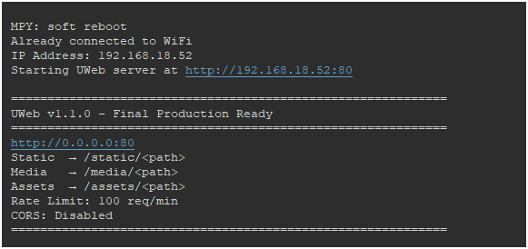
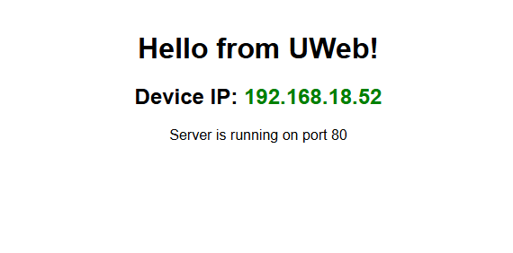

# UWeb - Ultra Web Framework for MicroPython

**Version 1.1.0 – Final Production Ready**

A lightweight, secure, and feature-rich asynchronous web framework designed specifically for MicroPython on resource-constrained devices (ESP32, RP2040, ESP8266, etc.).

UWeb provides a clean Flask-like API with routing, authentication, WebSockets, static/media file serving, input validation, rate limiting, and security headers — while remaining extremely memory-efficient.

---

## Features

- **Async HTTP server** based on `uasyncio`
- **Routing** with path parameters (`<id:int>`, `<name:str>`, `<path:path>`)
- **Built-in static & media serving** (`/static/`, `/media/`, `/assets/`)
- **WebSocket support** with rooms, broadcast, ping/pong and heartbeat
- **JWT-style token authentication** + refresh tokens + session management
- **Input validation** (SQL injection & XSS protection, type checking)
- **Rate limiting** per IP
- **CORS** support
- **Security headers** (X-Frame-Options, nosniff, XSS-Protection, etc.)
- **Simple template engine** (`{{variable}}`)
- **Multipart form & file upload** handling
- **Middleware** system
- **Memory optimized** (`__slots__`, careful GC usage, limited caches)

---

## Requirements

- MicroPython 1.19+ (recommended 1.22 or newer)
- `uasyncio`, `ujson`, `uhashlib`, `ubinascii` (included in most ports)
- At least ~100–150 KB free RAM recommended for comfortable usage

Tested on:
- ESP32 / ESP32-S3
- Raspberry Pi Pico W (RP2040)
- ESP8266 (limited — reduce `MAX_REQUEST_SIZE` and rate limits)

---

## Installation

1. Copy `uweb.py` to your device (or into a `lib/` folder).
2. Create the required directories (optional — they are created automatically):

```python
import os
os.mkdir("templates")
os.mkdir("static")
os.mkdir("media")
```

---

## Quick Start

```python
from uweb import UWeb

app = UWeb(secret_key="your-super-secret-key-change-me", debug=True)

@app.get("/")
def home(req):
    return app.html("<h1>Hello from UWeb!</h1>")

@app.get("/api/hello/<name:str>")
def hello(req, name):
    return {"message": f"Hello, {name}!"}

@app.post("/api/echo")
def echo(req):
    data = req.json()
    return {"received": data}

# Run the server
import uasyncio as asyncio
asyncio.run(app.run(host="0.0.0.0", port=80))
```



---

## Routing

```python
@app.route("/users/<id:int>", methods=["GET", "PUT", "DELETE"])
def user_handler(req, id):
    ...

@app.get("/files/<path:path>")          # catches remaining path segments
def files(req, path):
    ...

@app.post("/login")
@app.put("/items/<item_id:int>")
@app.delete("/items/<item_id:int>")
@app.patch("/profile")
@app.ws("/ws")                          # WebSocket route
```

Supported parameter types:
- `str` (default)
- `int`
- `float`
- `path` (captures the rest of the URL)

---

## Request Object

```python
req.method
req.path
req.query_params
req.headers
req.body
req.client_ip
req.user_agent
req.user                 # set after authentication

req.json()               # parse JSON body
req.json(schema={...})   # with validation
req.form()               # form-urlencoded or multipart
req.query("key", default=None)
req.header("Authorization")
req.file("avatar")       # uploaded file dict
```

---

## Response Helpers

```python
app.json({"ok": True}, status=200)
app.html("<h1>Page</h1>")
app.text("plain text")
app.file(binary_data, filename="report.pdf")
app.redirect("/login")
app.error(404, "Not found")
app.render_template("index.html", {"title": "Home"})
```

You can also return a `Response` object directly or a plain dict/list (automatically converted to JSON).

---

## Authentication

```python
# Login
@app.post("/login")
def login(req):
    data = req.json()
    # ... verify credentials ...
    return app.login(user_id=123, extra_data={"roles": ["admin"]})

# Protected route
@app.get("/profile")
def profile(req):
    result = app.require_auth(req)
    if isinstance(result, Response):
        return result
    return {"user_id": req.user["user_id"]}

# Role-based
@app.get("/admin")
def admin(req):
    result = app.require_role(req, ["admin"])
    if isinstance(result, Response):
        return result
    return {"secret": "data"}
```

Tokens are sent as:  
`Authorization: Bearer <access_token>`

---

## WebSockets

```python
@app.ws("/chat")
async def chat(ws, req):
    await ws.send({"type": "welcome", "msg": "Connected"})
    while ws.connected:
        msg = await ws.receive()
        if msg is None:
            break
        if isinstance(msg, dict) and msg.get("type") == "pong":
            continue
        # broadcast example
        await app.ws_manager.broadcast("general", msg)
```

Available methods on `WebSocket`:
- `await ws.send(data)`
- `await ws.receive()`
- `await ws.ping()`
- `await ws.close()`

Manager helpers:
- `app.ws_manager.broadcast(room, message)`
- `app.ws_manager.get_client_count()`
- `app.ws_manager.get_room_clients(room)`

---

## Static & Media Files

Automatically available:

| URL prefix     | Directory   | Description          |
|----------------|-------------|----------------------|
| `/static/...`  | `static/`   | CSS, JS, images      |
| `/assets/...`  | `static/`   | Alias of static      |
| `/media/...`   | `media/`    | User uploads         |

```python
# Upload
@app.post("/upload")
def upload(req):
    f = req.file("file")
    if f:
        app.upload_media(f["filename"], f["data"])
        return {"ok": True}
    return app.error(400, "No file")
```

---

## Middleware

```python
def auth_middleware(req, app):
    if req.path.startswith("/api/private"):
        result = app.require_auth(req)
        if isinstance(result, Response):
            return result
    return None   # continue

app.use(auth_middleware)
```

---

## CORS

```python
app.enable_cors(
    origins=["https://myfrontend.com", "http://localhost:3000"],
    methods=["GET", "POST", "PUT", "DELETE"],
    headers=["Content-Type", "Authorization"]
)
```

---

## Configuration Options

```python
app = UWeb(
    secret_key="change-me-in-production",
    rate_limit=60,                # requests per minute per IP
    templates_dir="templates",
    static_dir="static",
    media_dir="media",
    debug=False
)

app.max_request_size = 256 * 1024   # optional override
```

---

## Security Features

- Input sanitization against common SQL injection & XSS patterns
- Automatic security headers on every response
- Rate limiting
- IP blacklisting support (`app.blacklisted_ips.add("1.2.3.4")`)
- HttpOnly + SameSite cookies
- Path traversal protection on static/media/file operations
- Token blacklisting (in-memory)

---

## Limitations (MicroPython Reality)

- Template engine is very basic (only `{{var}}` replacement)
- No persistent session/token store (lost on reboot)
- Multipart parser is lightweight — keep uploads small
- Maximum concurrent WebSockets limited by RAM (default 50)
- No HTTPS (use a reverse proxy or MicroPython SSL if available)

---

## License

MIT License – free for personal and commercial use.

---

## Credits

Designed and optimized for real-world MicroPython deployments.  
Feedback and contributions are welcome.

**Happy coding on the edge!**
